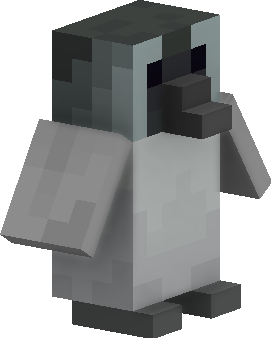
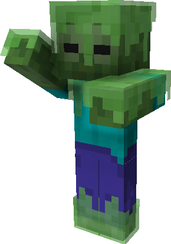
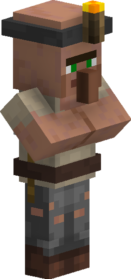

## Hey there!

  
  

    
  

  
  

    I'm HonKit26113, an add-on creator making content for Minecraft Bedrock. I've been playing the game since 2013, and it's become a big part of my life.
  

  
  

    I started making add-ons in July 2020 with the aim of enhancing Minecraft's gameplay. Since then, I've worked on many different projects, most notably _Beyond The Underground_, a vanilla style add-on that adds new cave types, and _Item Info+_, a quality-of-life resource pack.
  

  

    
  

  
  

    
  

  
  

    The quality of add-ons is always my top priority. As I'm also getting busier with real life responsibilities, add-on updates take longer to work on. That said, I still hope to continue creating fun and intriguing content for everyone.
  

Have a good day, folks!
