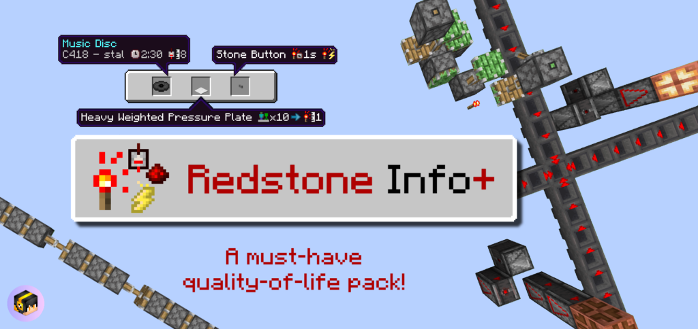

This is the central hub of my creations! Follow me on [X / Twitter @HonKit1103](https://x.com/HonKit1103) for update announcements & sneak peeks.

# Featured Packs

  
  

    
  

  
  

    
    ### Beyond The Underground

    Adds 8 new cave types for you to explore. Tread carefully, fend off aggressive mobs, and find yourself treasure & special weapons!

    <a class="index-page-button" href="/beyond-the-underground/">Take Me There!</a>

  

  
  

    
  

  
  

    ### Item Info+

    A must-have quality of life pack! Show stats on item names using simple and colorful icons. See a mob's HP, mob hostility, banner, firework, enchantment icons, foods' hunger & saturation points, armor points, potion stats, and more.

    <a class="index-page-button" href="/item-info-plus/">Take Me There!</a>

  

  
  

    
  

  
  

    ### Redstone Info+

    A quality of life pack that makes it easier to build with redstone! This pack not only adds new textures, but also new icons to item names to display more information.

    <a class="index-page-button" href="/redstone-info-plus/">Take Me There!</a>

  

