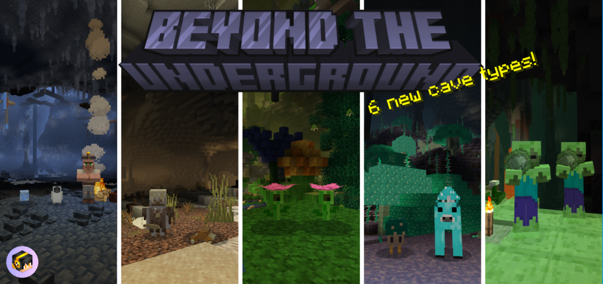

This add-on adds 8 new cave types for you to explore. Tread carefully, fend off aggressive mobs, and find yourself treasure & special weapons!

Requires Minecraft Bedrock 26.20 or later.
[Download Now!](https://www.curseforge.com/minecraft-bedrock/addons/beyond-the-underground-addon)

# Luminous Caverns
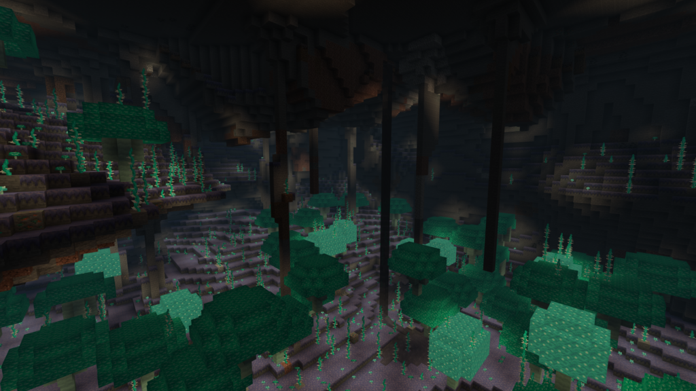

- These caves generate exclusively under **Mushroom Islands**

- This is a peaceful cave with no natural hostile mobs spawning

- The entire cave is slightly lit up with vegetation!

    <b>Click to show more</b>

## Vegetation & Foliage

- **Giant Luminous Mushrooms** & **Giant Gloomy Mushrooms** generate in this cave

- **Normal-sized mushrooms** generate on the surface

- **Radiant Vines** grow from the ground

- These plants all emit a small amount of light!

## Food

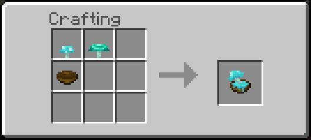

- **Luminous Mushroom Stew** can be crafted with 1 Bowl, 1 Luminous Mushroom, and 1 Gloomy Mushroom
    - Replenishes 6 hunger points (3 hunger bars)
    
    - Gives you Night Vision for 15 seconds

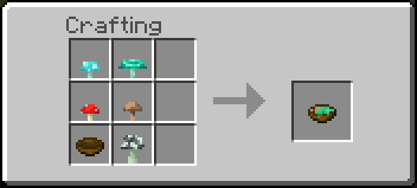

- **Mysterious Stew** can be crafted with 1 Bowl, 1 Luminous Mushroom, 1 Gloomy Mushroom, 1 Red Mushroom, 1 Brown Mushroom, and 1 Mysterious Mushroom
    - Replenishes 3 hunger points (1.5 bars)
    
    - Gives you 1-2 random effects (selecting from all positive and negative effects)

## Ores

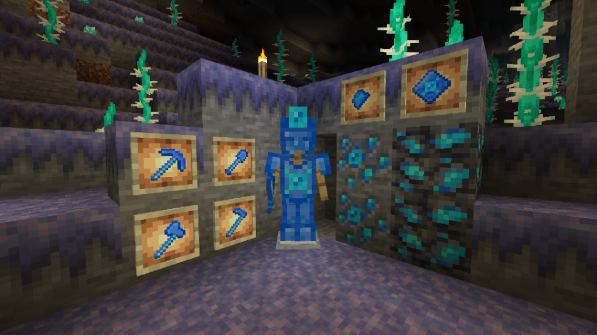

- **Luminite** is a blue gemstone that can be found in Luminous Caverns

- Luminite Ore generates at Y levels -64 to 12
    - Drops 1-2 Luminite Shards when broken

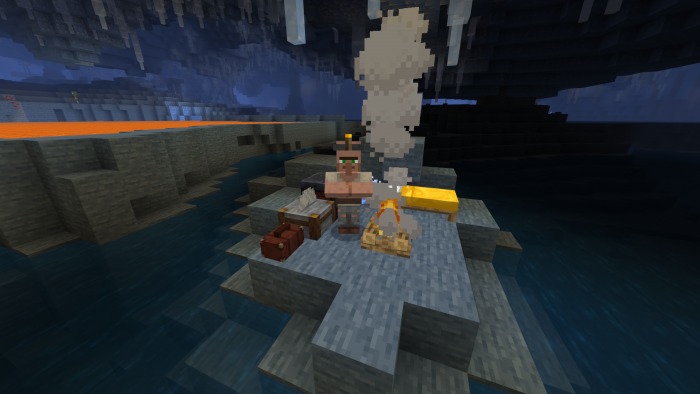

- Combine 6 Luminite Shards and 1 Diamond in a Crafting Table to get 1 Luminite

- Luminite can be used to craft gear!

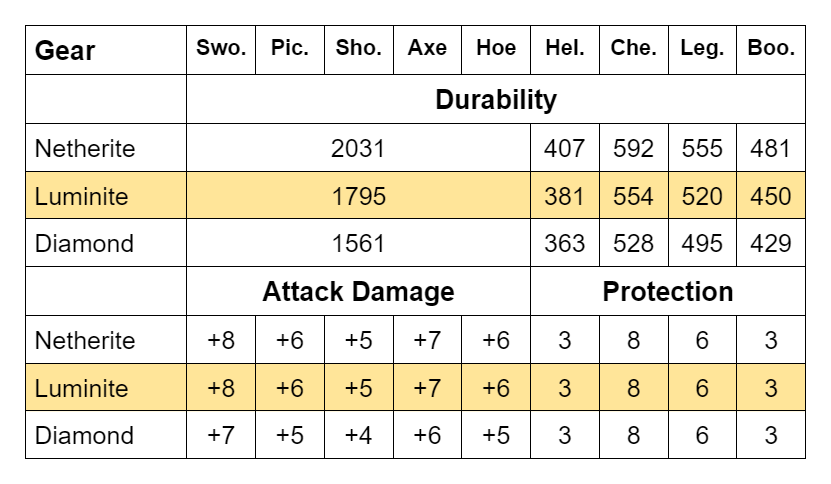

- As Luminite gear is harder to obtain than Diamond gear but also easier to obtain than Netherite, the stats of Luminite gear are in between Diamond and Netherite gear.

## Mobs

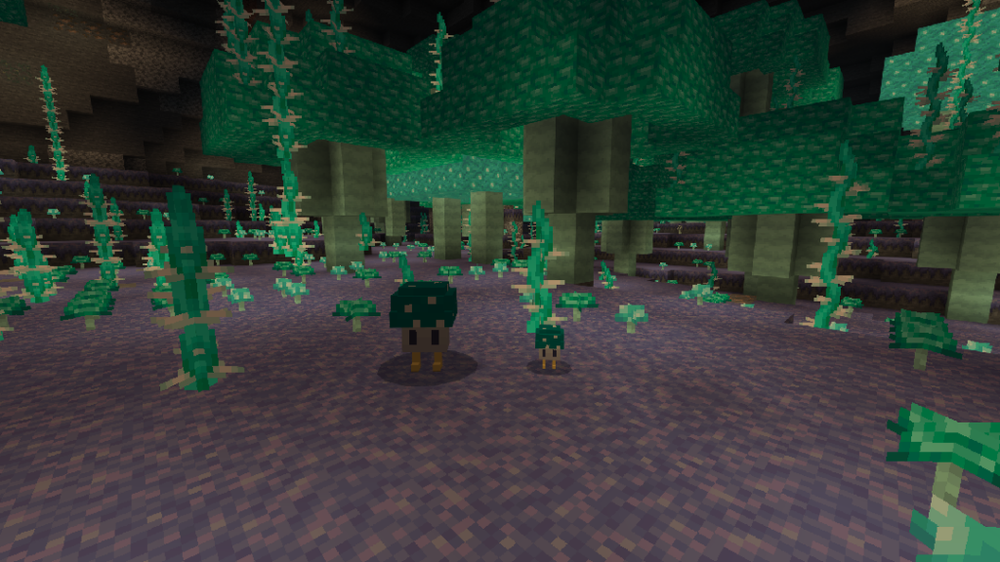

- **Shroom Elves** spawns in Luminous Caverns

- They can be bred using Luminous Mushrooms

- They spawn in large groups of 4-8

- They have 8 health (4 hearts) and die almost instantly from lava

- They run away from the player but can be lured using Luminous Mushrooms

- They drop 0-2 Luminous Mushrooms when killed

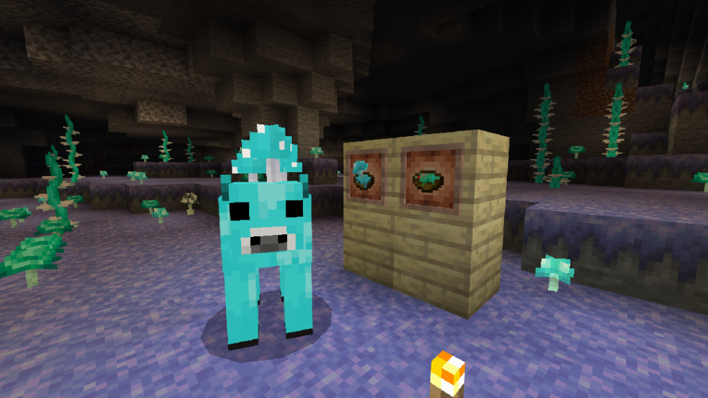

- **Luminous Mooshrooms** spawns in Luminous Caverns

- They can be bred using Wheat

- Interact with them using:
    - A bucket to get milk
    
    - A bowl to get **Luminous Mushroom Stew**
    
    - Mysterious Mushroom first, then a Bowl to get **Mysterious Stew**
    
    - Shears to get Luminous Mushrooms. This will turn them into normal cows

# Slimy Sewers
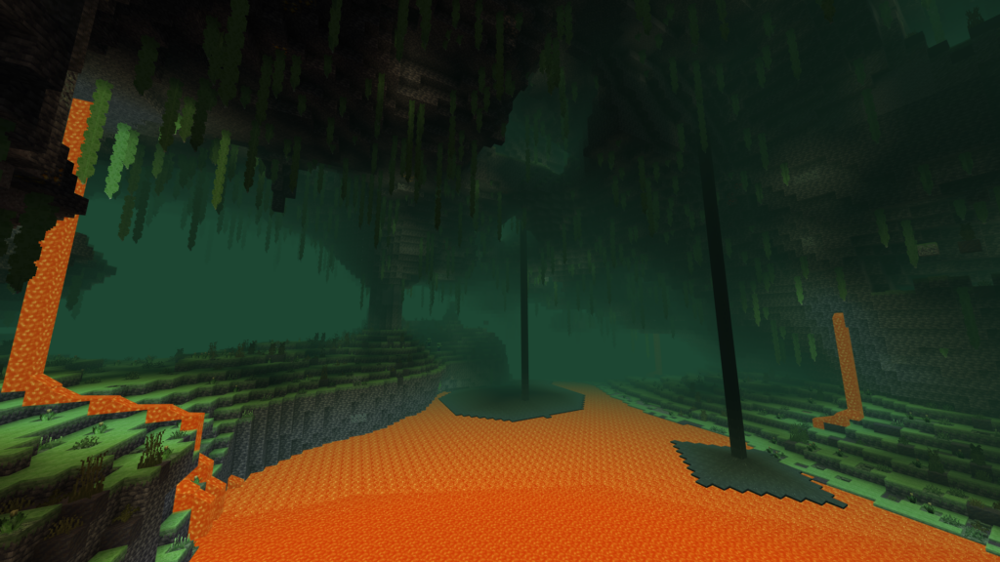

- These caves generate exclusively under **Swamps**

- This is a very dangerous cave with thick green fog, limiting your render distance

    <b>Click to show more</b>

## Vegetation & Foliage

- A layer of **Slimy Stone** replaces Stone on the surface, which slows you down

- **Slime Layers** cover most of the floor

- **Slimy Blossoms** and **Slimy Sprouts** scatter across the cave

- **Sticky Spikes** generate on the surface and hurts you when you step on them

- **Slime drips** from the ceiling

- **Mud**, **Tall Grass** and **Slimy Pebbles** can be found here

## Food

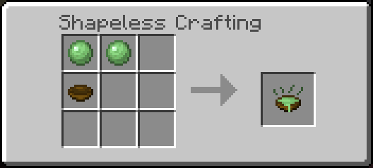

- **Slime Soup** can be crafted with 1 Bowl and 2 Slimeballs
    - Replenishes 3 hunger points (1.5 bars)
    
    - Gives you Jump Boost II for 8 seconds and Resistance II for 5 seconds
    
    - Has a 45% chance to also give you Hunger I for 30 seconds and Nausea II for 20 seconds

## Mobs

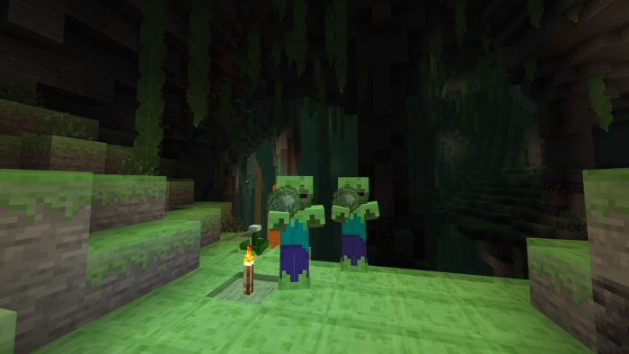

- **Slimy Zombies** spawn in the Slimy Sewers

- They spawn in large hordes of 4 to 7

- They have 20 health (10 hearts) like regular zombies

- They **throw Hardened Slimeballs at enemies which deal 7 damage (3.5 hearts) with no armor**

- They drop Rotten Flesh and Hardened Slimeballs when killed

- **Vanilla Minecraft Slimes spawn more frequently here, in groups of 2 to 4**

- **Vanilla Minecraft Witches also spawn more frequently here, in groups of 1 to 3**

## Structures

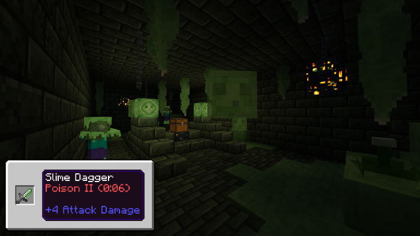

- **Slime Dungeons** generate under Swamps between Y=-59 and 47.
    - There are 2 variants: Stone & Deepslate, for their respective Y levels
    
    - There are 3 spawners, 1 with Slimes, and 2 with Slimy Zombies
    
    - There is a treasure chest in the middle with valuable loot, including the **Slime Dagger** (exclusively found here!)
    
    - Slime Daggers deal 6 seconds of Poison II to any mob attacked using this weapon

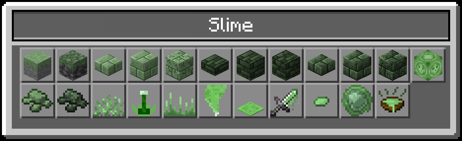

- Here is everything new you can get from the Slimy Sewers.

- Slime Dungeons are built using **Slimy Stone Bricks**, **Slimy Deepslate Bricks**, and **Slimy Deepslate Tiles**. You can craft them using Slimy Stone and Slimy Deepslate!

- **Slime Lanterns** can be crafted using 1 Glowstone and 4 Hardened Slimeballs!

  

# Limestone Caves
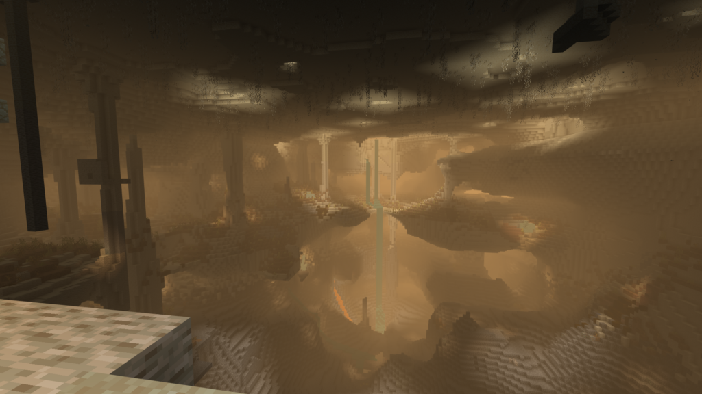

- These caves generate exclusively under **Deserts**

- This is a very dusty cave with thick yellow fog

    <b>Click to show more</b>

## Vegetation & Foliage

- All stone in this cave is replaced with **Limestone, Cobbled Limestone, Calcite, and Sandstone**

- Patches of **Quicksand** and **Coarse Dirt** occasionally generate

- **Limestone Pebbles**, **Cobbled Limestone Pebbles**, and **Sand Layers** can be found on the floor

- **Sandy Roots** hang from the ceiling

## Mobs

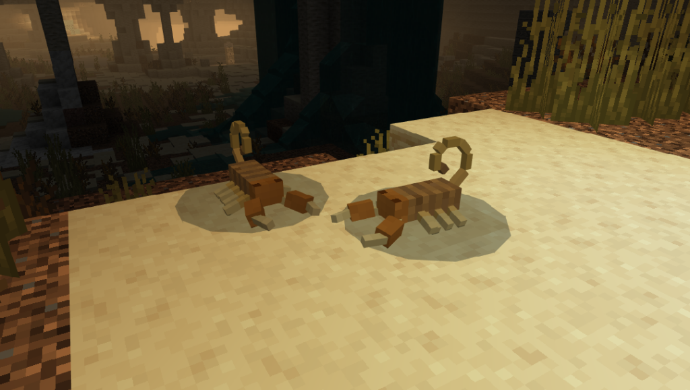

- **Scorpions** spawn in the Limestone Caves

- They spawn in swarms of 2 to 4

- They have 16 health (8 hearts)

- They **inflict 10 seconds of Poison every attack**

- They drop Raw Scorpion items on death (or Cooked Scorpion items if died in fire or lava)

- **Vanilla Minecraft Husks also spawn more frequently here, in hordes of 2 to 4**

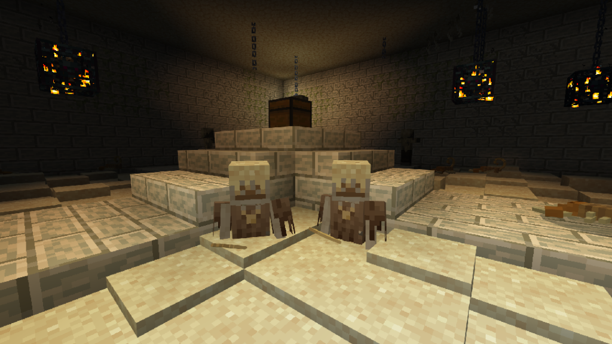

- Sandy Skellies spawn in the Limestone Caves in groups of 1 to 2

- They have 16 health (8 hearts)

- They have a 10% chance to drop their skull when killed

## Special Weapon

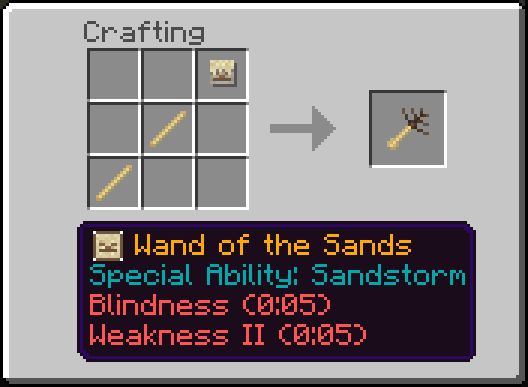

The **Wand of the Sands** can be crafted using Sandstone Sticks (found in Limestone Dungeons) and 1 Sandy Skelly Skull.

They can be used to trigger sandstorms, inflicting Blindness and Weakness II to opponents!

## Food

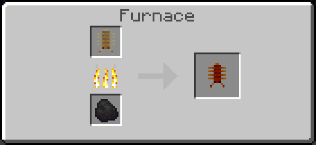

- Raw Scorpion items drop from Scorpions on death
    - Replenishes 1 hunger point (0.5 bars)
    
    - Gives you Fatal Poison II for 10 seconds, Nausea III for 8 seconds, and Hunger III for 10 seconds

- Raw Scorpion items can be smelted in a Furnace or Smoker to make a Cooked Scorpion
    - Replenishes 5 hunger points (2.5 bars)

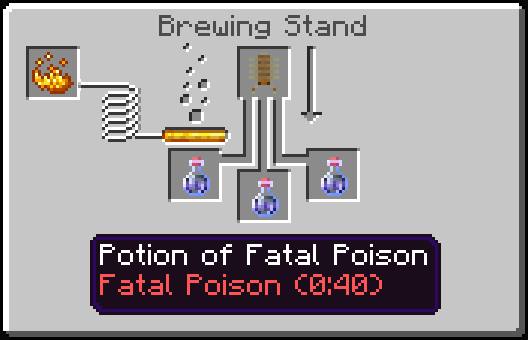

- Raw Scorpion items can be used to brew **Fatal Poison potions**.

## Structures

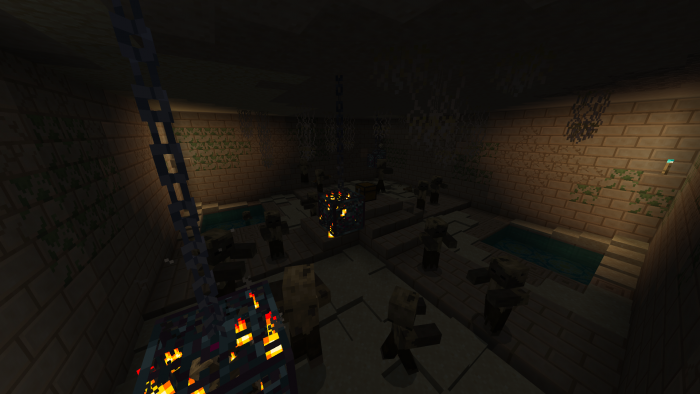

- **Limestone Dungeons** generate under Deserts between Y=6 and 40.
    - There are 4 spawners, 2 with Scorpions, and 2 with Husks
    
    - There is a treasure chest in the middle with valuable loot, including diamonds, golden apples, and/or enchanted apples

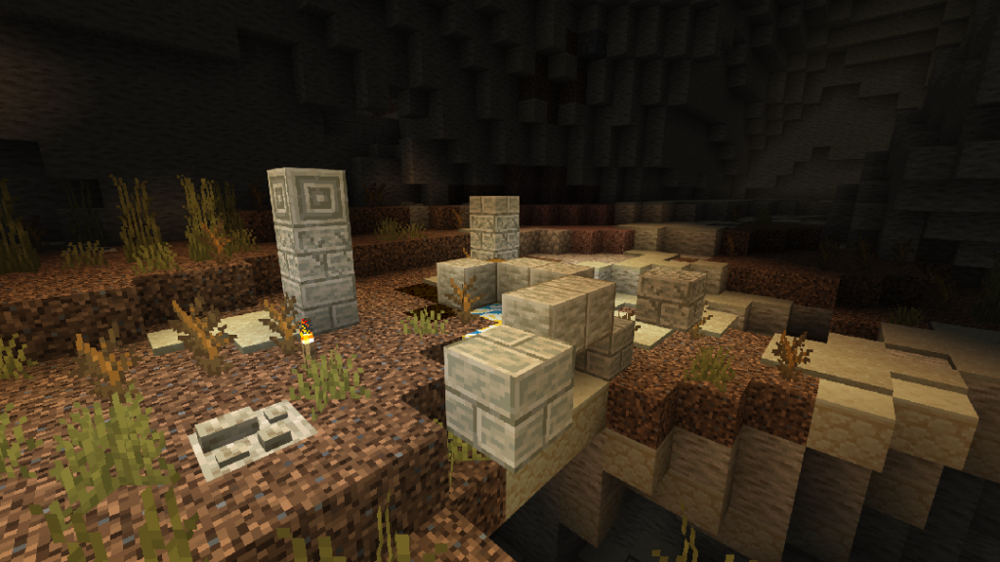

- **Limestone Ruins** can be found in Limestone Caves between Y=6 and 47.
    - All ruins have a chest, which contains useful items.
    
    - There are 6 variants in total. See if you can find them all!

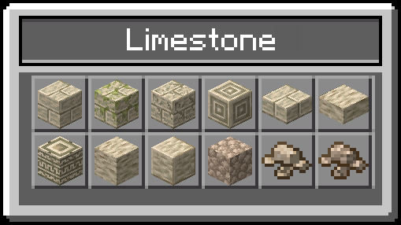

- Limestone Dungeons & Limestone Ruins are built using **Limestone Bricks**. You can craft them using Limestone, and there are many other variants as well!

  

# Ice Caves

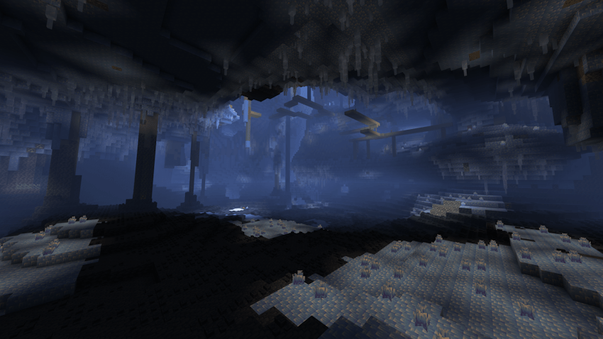

- These caves generate exclusively under **frozen biomes**

- Ice can be found everywhere, such as dripping icicles and ice crystals

    <b>Click to show more</b>

## Vegetation & Foliage

- **Ice Crystals, Frosted Stone and Frosted Deepslate** replaces most stone on the cave surface

- **Crystallized Ice** and **Blue Ice** make up the cave ceiling

- **Pebbles** can be found on the floor

- **Icicles** drip from the ceiling

## Mobs

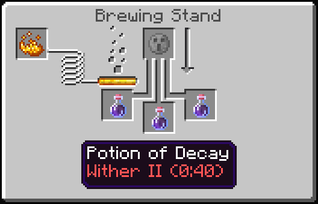

- **Penguins** spawn in the Ice Caves and on the surface of frozen biomes

- They spawn in groups of 3 to 5 on the surface and 2 to 4 underground

- They have 10 health (5 hearts)

- They cannot be tamed but can be lured and bred using Raw Cod and Raw Salmon

- **Vanilla Minecraft Strays also spawn more frequently here, in armies of 2 to 4**

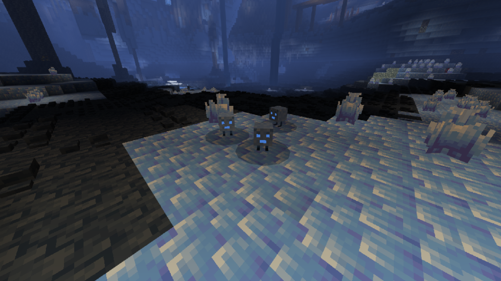

- **Frost Spirits** spawn in the Ice Caves

- They are playful little ice cubes that jump and attack you

- They have 16 health (8 hearts)

- They deal 3 damage (1.5 hearts) per hit

- They drop **Frost Essence,** which can be used for brewing and crafting a special weapon

## Potions

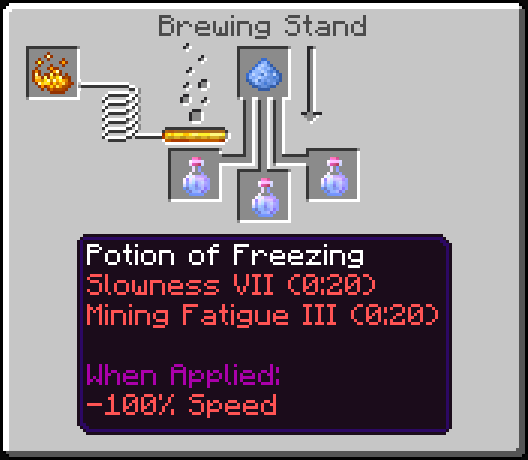

- **Frost Essence** can be used to brew Freezing potions, which gives you Slowness and Mining Fatigue.

## Structures

- **Lost Explorer Camps** generate under frozen biomes (in ice caves) between Y=-30 and 20.
    - Lost Explorers trade you materials from the surface for things found underground
    
    - **Because of a Minecraft bug, Lost Explorers do not spawn along with the structure. To spawn the Lost Explorer, interact with the Suitcase when holding an Emerald.**

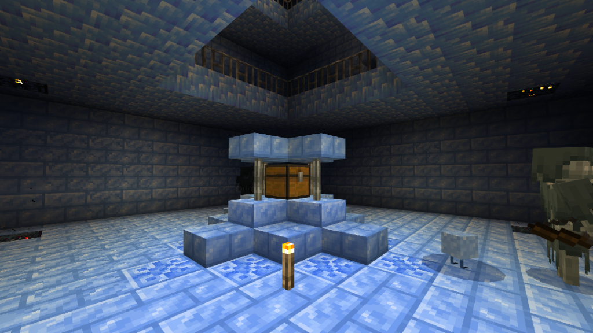

- Ice Dungeons generate in Ice Caves between y=-40 and 40.

- In the chest, you may find the Frozen Core and other valuables!

## Special Weapon

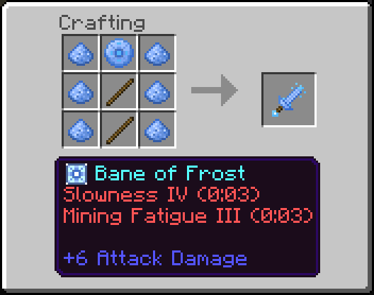

The **Bane of Frost** can be crafted using 6 Frost Essence, 1 Frozen Core, and 2 Sticks.

This weapon deals 6 damage and inflicts Slowness IV and Mining Fatigue III!

## Other Blocks

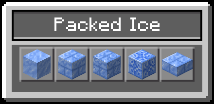

- **Packed Ice Bricks** can be crafted using Packed Ice. There is also **Chiseled Packed Ice** with a snowflake pattern!

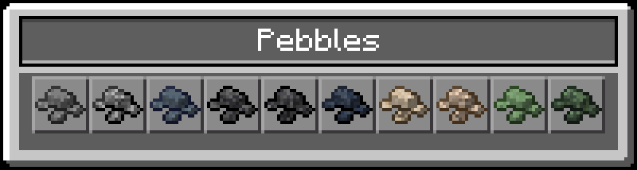

- **Pebbles** naturally generate here, except for Limestone variants. To craft more pebbles, simply put the respective block into a Stonecutter!

# The Undergrowth
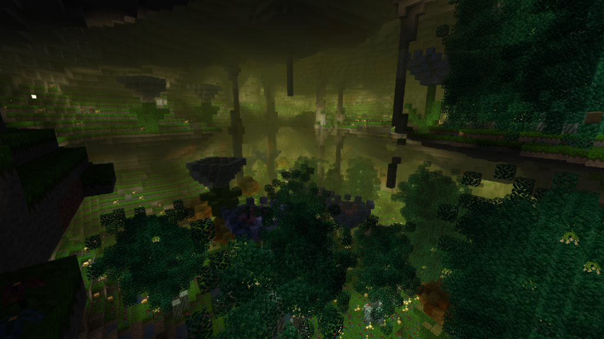

- Home to the Rainbow Gum Tree, giant flowers and mushrooms

- Watch out for the Thornspitter and their tracking thorns!

    <b>Click to show more</b>

## Vegetation and Foliage

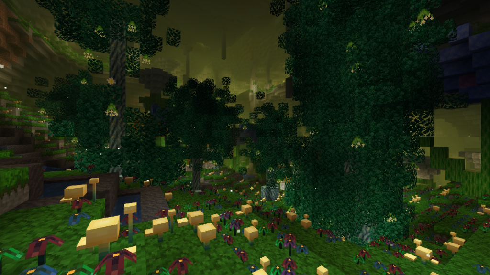

- Chromatic Petals and Twilight Spores generate everywhere

- Star Jasmine generate on Rainbow Gum trees

- Giant flowers are very common

## **Mobs**

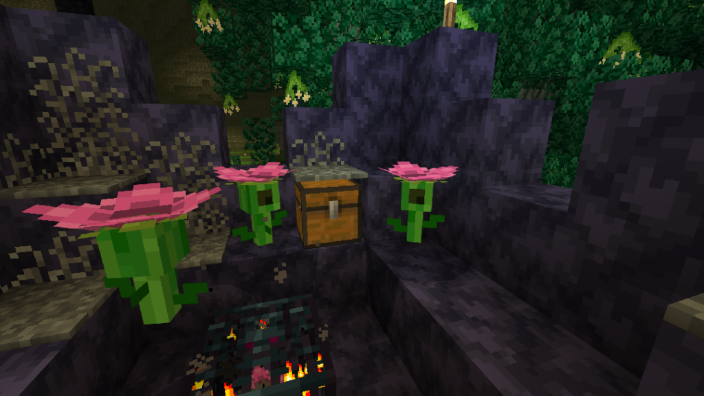

- **Thornspitters** spawn only in Giant Wither Roses.

- They shoot thorns at you

- They have 16 health (8 hearts)

- They drop melons with a 4% chance of dropping the Corrupted Bouquet

## **Structures**

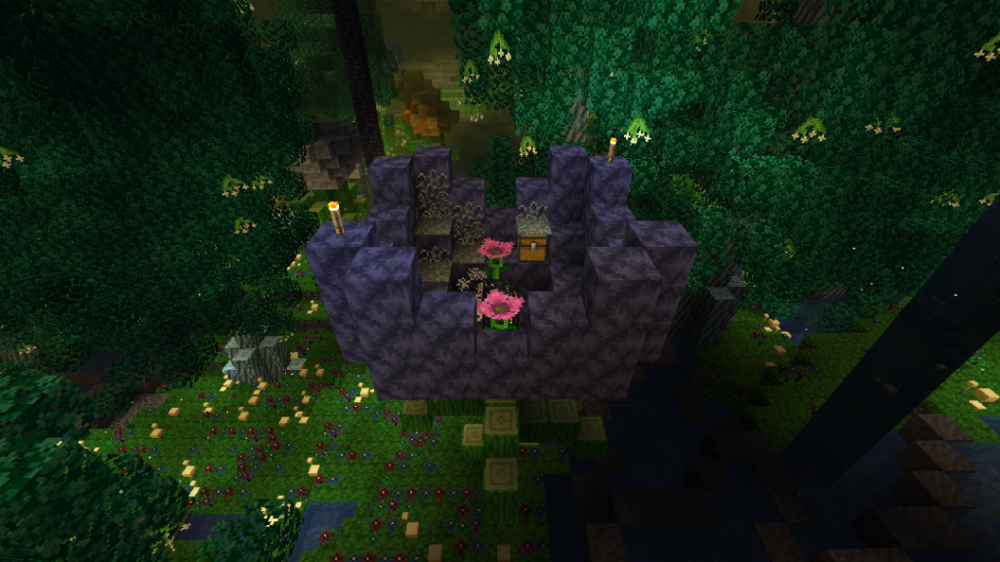

- Giant Flowers have a 4% chance to be Giant Wither Roses. These flowers have a Thornspitter spawner in them.

- The chest has an 70% chance of generating with a Corrupted Bouquet

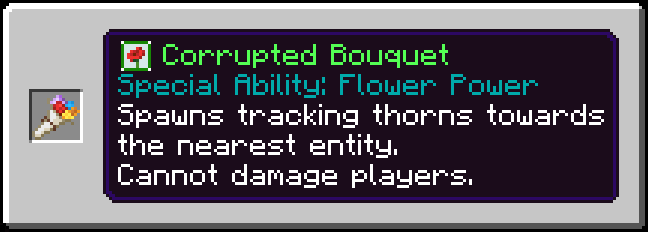

## **Other Blocks**

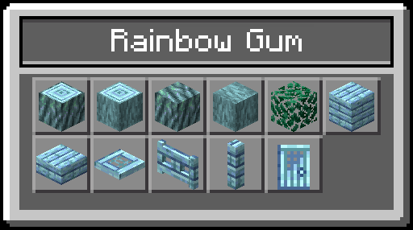

The **Rainbow Gum** tree comes with its own wood type!

# Soul Caverns
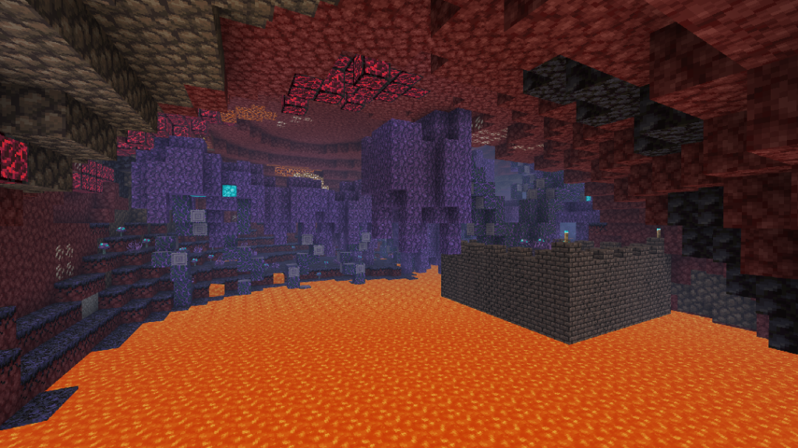

- These caves generate exclusively in new, giant caverns in the Nether Wastes!

- These caves are home to the Crooked Forest, with the new Crooked wood type

- Souls are present almost everywhere in this cave. Watch out for ghostly, wandering Wisps!

    <b>Click to show more</b>

## Vegetation & Foliage

- **Crooked Fungi** and **Crooked Roots** generate here

- **Giant Crooked Fungi** are found everywhere

- Lava pits and **Soul Geysers** are common in this cave. Tread carefully!

## Mobs

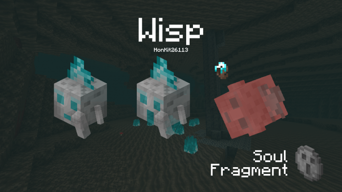

- **Wisps** spawn in the Soul Caverns and in Soul Sand Valleys

- They spawn in groups of 2 to 3

- They have 12 health (6 hearts)

- They shoot Souls at you, which deal a lot of damage!

- They drop **Soul Fragments** upon death, which can be used to craft the **Soul Healer**

- Soul Fragments can also be used to brew Potions of Decay, which give you the Wither effect.

## Food

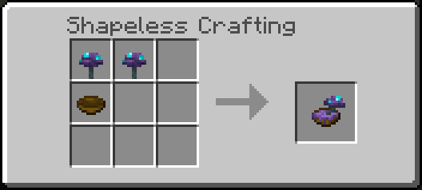

- **Crooked Fungus Stew** can be crafted with 1 Bowl and 2 Crooked Fungi
    - Replenishes 6 hunger points (3 bars)
    
    - Gives you Fire Resistance for 20 seconds

## Structures

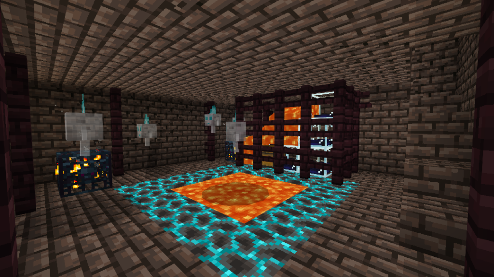

- **Soul Castles** generate in the Soul Caverns. Continue exploring, and you'll find one eventually!
    - There is 1 Wisp spawner
    
    - There is a treasure chest filled with goodies, ranging from **Soul Bricks** to Diamonds, Enchanted Apples, **Soul Fragments**, or even the **Soul Healer**!
    
    - Hidden underneath the lava are **Broken Lava Tanks**. Repair them in a Crafting Table first!

## Other Blocks

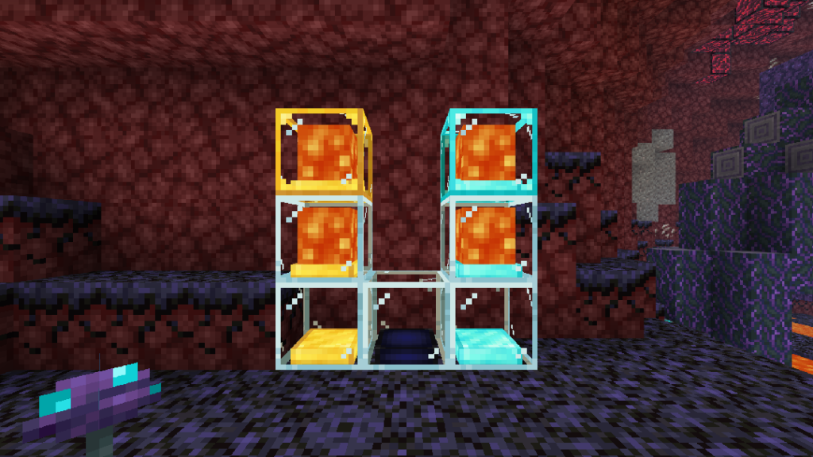

- **Lava Tanks** work like sponges, but for lava instead. Add either Gold Ingots or Diamonds to a Broken Lava Tank in a Crafting Table to repair them.

- The only source of Lava Tanks are the Soul Castles.

- Gold Lava Tanks remove lava from a 7x4x7 area, while Diamond Lava Tanks remove lava from a 11x6x11 area.

- Lava Tanks need to be cooled down after each use. Follow the in-game instructions for more details!

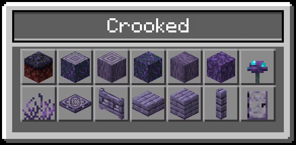

- The Soul Caverns include the new **Crooked** wood type.

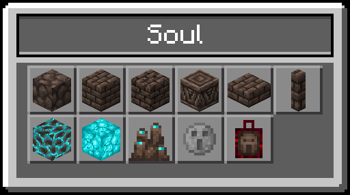

- Soul Stone generates in Soul Caverns and Soul Sand Valleys. Craft them into Soul Bricks for building!

# Credits

Thank you to everyone who contributed!

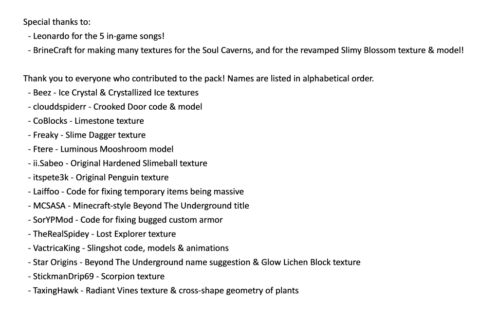

# Terms of Use

### **You are allowed to:**

- Edit the pack for **personal use**.

- Use the pack in your **private modpack** that you aren’t releasing publicly. You **cannot** use the pack in a public modpack.

- **Make videos & media content** with the pack.

### **You are NOT allowed to:**

- Distribute the pack using a new download link. Always share the link to to this page.

- Monetize the pack download. Doing so will result in a copyright takedown.

# Known Issues

- **This add-on may decrease performance on lower-end and weaker devices.**

- When you enter your world in a biome with a new cave type, it may take a while for all chunks to load. World generation may also take longer in general, especially on weaker devices.

# Changelog

 <b>Click here to show changelog</b>

Version 1.6  
Released March 6, 2025

**New Cave Type: Undergrowth!**

- Generates exclusively under Jungles and Roofed Forests
- Home to the Rainbow Gum Tree, giant flowers and mushrooms
- Watch out for the Thornspitter and their tracking thorns!

**New Blocks:**

- Cave Turf
- Deepslate Cave Turf
- Rainbow Gum Log (Normal, Stripped)
- Rainbow Gum Wood (Normal, Stripped)
- Rainbow Gum Leaves
- Petal Blocks (White, Blue, Red, Orange, Magenta, Black)
- Chromatic Petals
- Star Jasmine
- Twilight Spores
- Limestone Pillar
- Arena Trigger & Arena Pillar (unobtainable)

**New Mob:**

- Thornspitter. A spinning flower that shoots thorns at you.

**New Special Weapon:**

- Corrupted Bouquet. Spawns tracking thorns towards the nearest entity, dealing 10 damage. Will not damage players.

**Introducing Arena Battles!**

- Arenas generate in Limestone Caves between y=6 and y=50.
- Interact with the gray Arena Trigger to start the battle!
- Defeat all mobs within the time limit to receive rewards.
- Arena Battles cannot start in Peaceful. Check your difficulty!

**Changes:**

- New pack icon!
- New menu screen panorama!
- Many blocks & items across all cave types received a new texture. (Thank you, BrineCraft!)
- Many non-full blocks can now be waterlogged, including slabs and pebbles.
- Non-solid blocks no longer allow redstone dust to stair-step downward to another block.
- Most blocks now have different breaking speeds depending on the tool used.
- Items in the inventory are now organized according to the cave type they are from.
- Changed the blast resistance of many blocks to match vanilla variants.
- Changed naming format of spawn eggs to match vanilla.
- Changed the blockstates of the Crooked Trapdoor. This means it will revert to its original state and you may have to place/open them again.
- Crooked Doors, Crooked Trapdoors and Crooked Fence Gates now react to redstone input.
- Changed block states of the Crooked Door. You will need to break and place them back after updating.
- Merged the block and item IDs of the following items. This means \*all\* these items will disappear from your world unless they are placed down.
    - All types of Pebbles
    - Luminous Mushroom
    - Gloomy Mushroom
    - Mysterious Fungus
    - Slimy Sprouts
    - Slimy Blossom
    - Sticky Spikes
    - Sandy Skelly Skull
    - Ice Crystal
    - Crooked Fungus
    - Crooked Roots
    - Crooked Door
    - Soul Geyser
- The fog in Deserts and Limestone Caves is now less dense.
- Limestone Dungeons now generate less commonly.
- Renamed the Mysterious Fungus to Mysterious Mushroom.
- The Luminous Mushroom, Gloomy Mushroom, Mysterious Mushroom, Slimy Sprouts, Crooked Fungus and Crooked Roots are now destroyed by water.
- Pebbles and Lava Tanks now have their own item group in the creative inventory.
- Cobbled Limestone has been moved to the nature tab.
- Sticky Spikes can now be placed on any block.
- Chiseled Soul Bricks now have different textures for up/bottom and side faces. (Thank you, BrineCraft!)
- When cooling down Lava Tanks, the game no longer sends the "You have been given Bucket \* 1" message.
- For performance reasons, Glowing Obsidian no longer emits particles.
- This add-on now requires Minecraft 1.21.60 or above to function.

**Fixed Bugs:**

- Giant Luminous Mushrooms, Gloomy Mushrooms and Crooked Fungi now generate without being cut off.
- Luminous Mushroom Stew now gives the correct effects.
- Hardened Slimeballs, Sand Lumps and Souls shot by Wisps now emit the correct particles.
- Sand Layers once again generate in Limestone Dungeon chests.
- Slime Layers once again generate in Slime Dungeon chests.
- Dripping Slime and Dripping Icicles now emit the correct particles.
- "Invalid particle type" warnings no longer appear in the content log.
- Errors no longer occur when standing on Soul Magma Blocks.
- Fixed step-on effect of the Soul Geyser and Sticky Spikes.
- Errors no longer appear when a mob attacks other mobs.
- Hardened Slimeballs, Sand Lumps and Thrown Souls no longer appear as placeholder strings in death messages.
- The Bane of Frost now breaks Crystallized Ice faster.
- Crooked Stems can once again be rotated.
- Lava Tanks no longer return an empty bucket when cooling them down in creative.
- Obsidian can once again be emptied from Lava Tanks.
- Sounds now play when adding more layers to Slime and Sand Layers.
- Fixed Suitcases not summoning the Lost Explorer when interacted with using an emerald.
- Crooked Doors can now be crafted.
- Item names of Crooked Doors are now translated into Simplified and Traditional Chinese.

