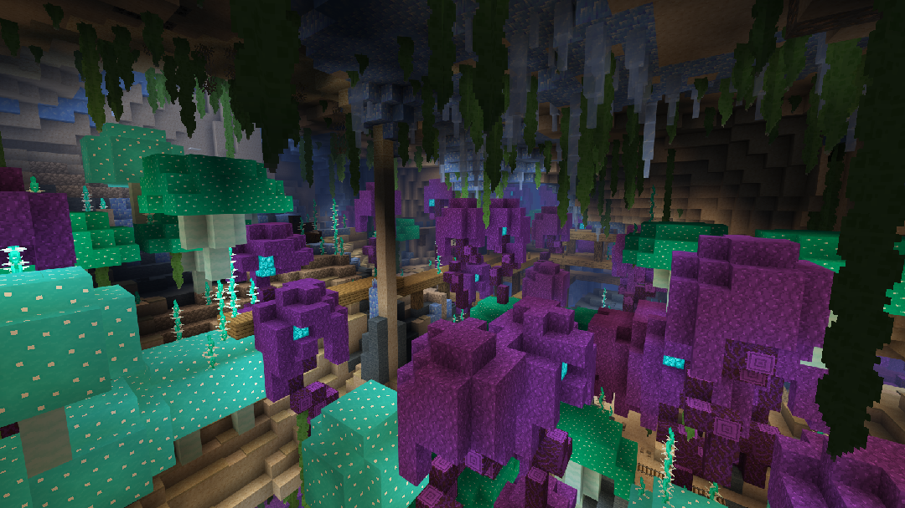

  
  

    
  

  
  

    
    ### Check out my add-ons and packs

    The central hub of my creations!  

    <a class="index-page-button" href="/beyond-the-underground/">Take Me There!</a>

  

  
  

    
  

  
  

    ### iOS Import Tutorial

    Having trouble importing .mcpack and .mcaddon files into Minecraft on iOS? Follow this tutorial!

    <a class="index-page-button" href="/ios-import-tutorial/">Take Me There!</a>

  

