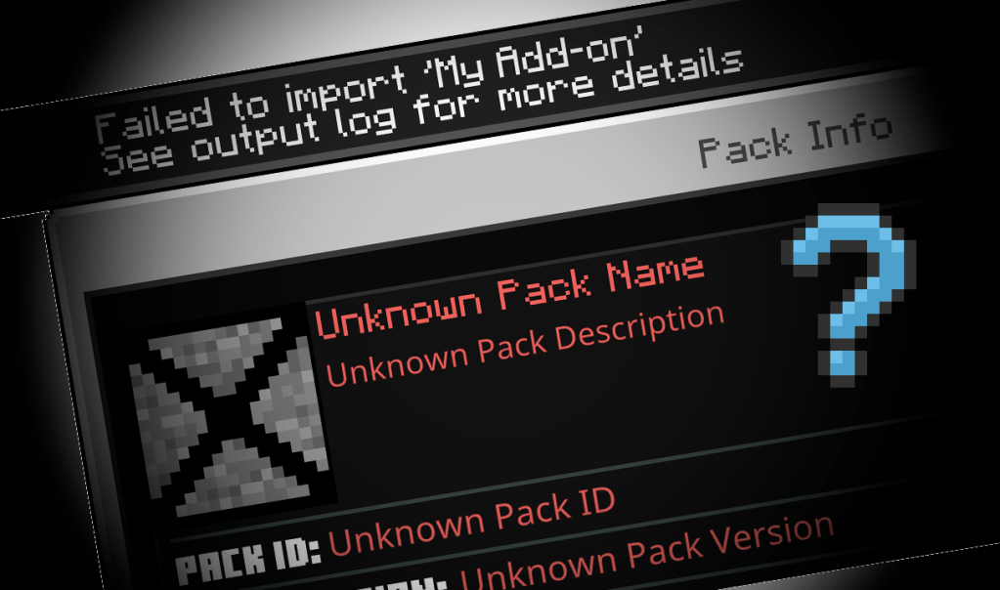
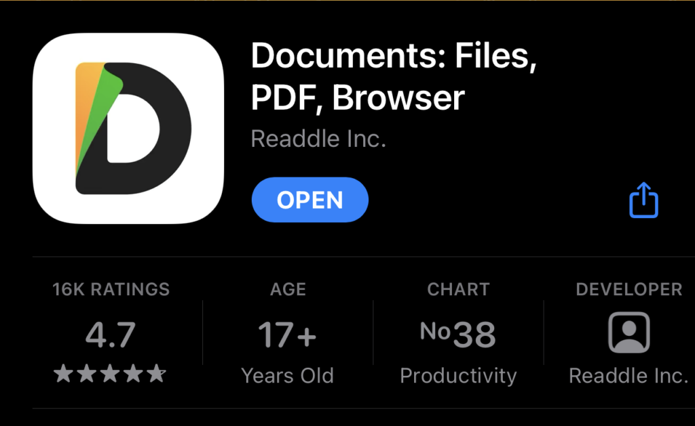
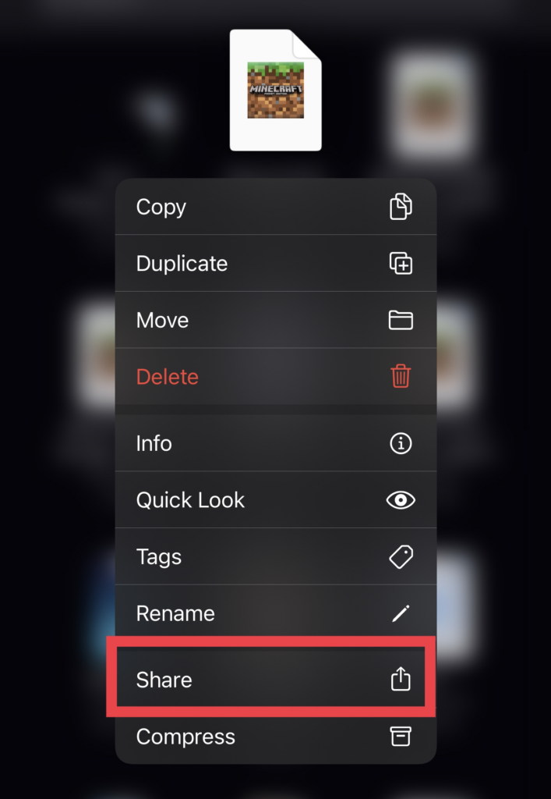
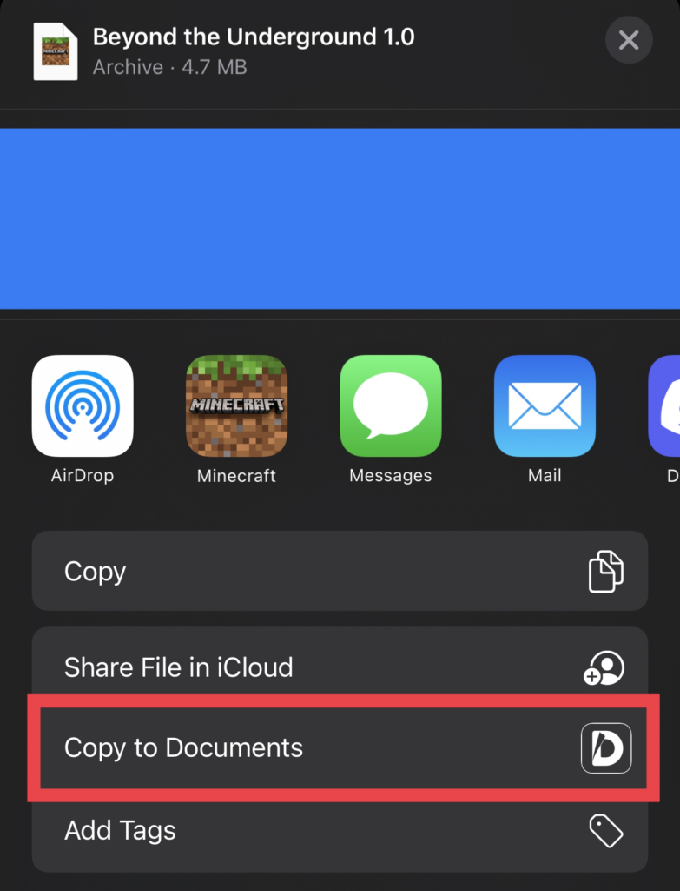
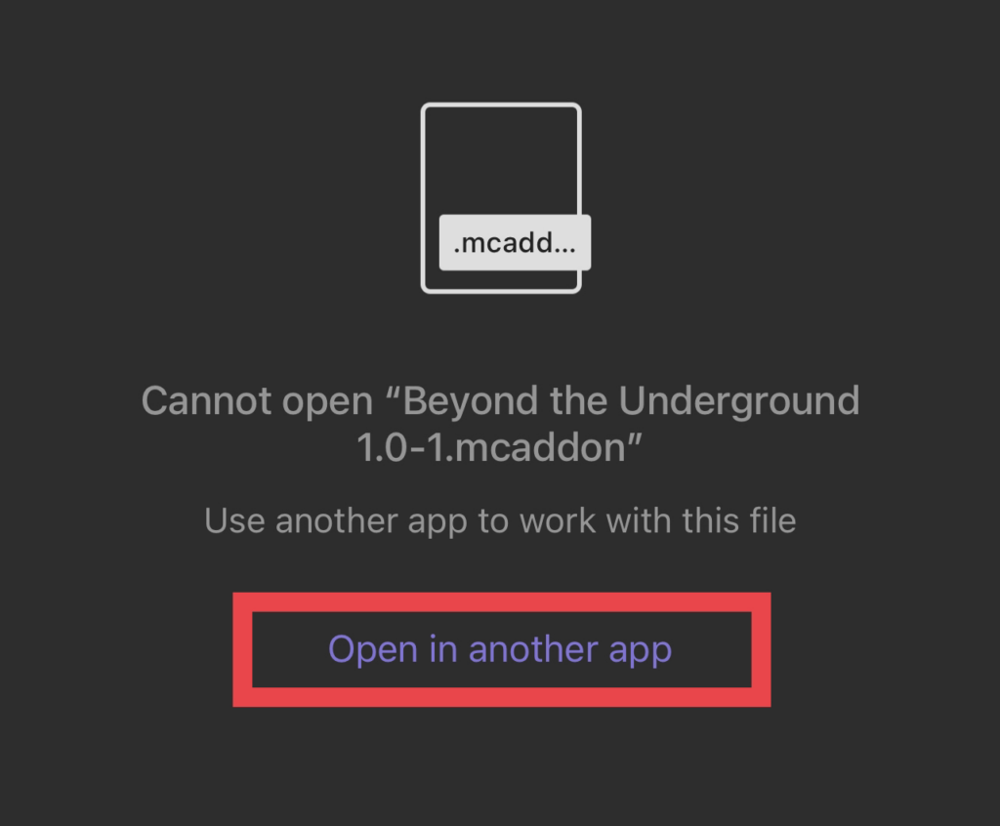
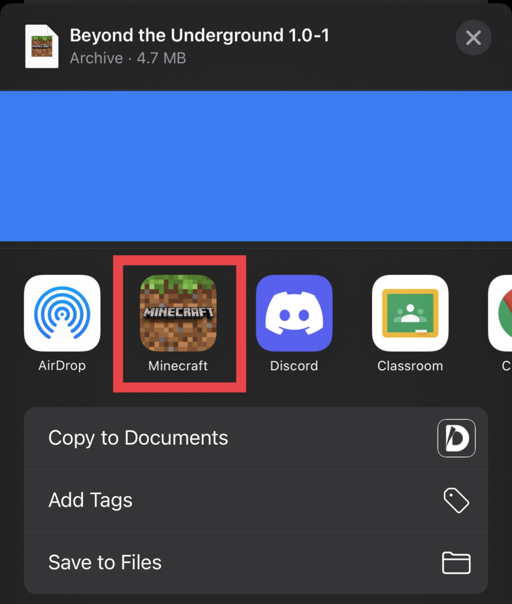
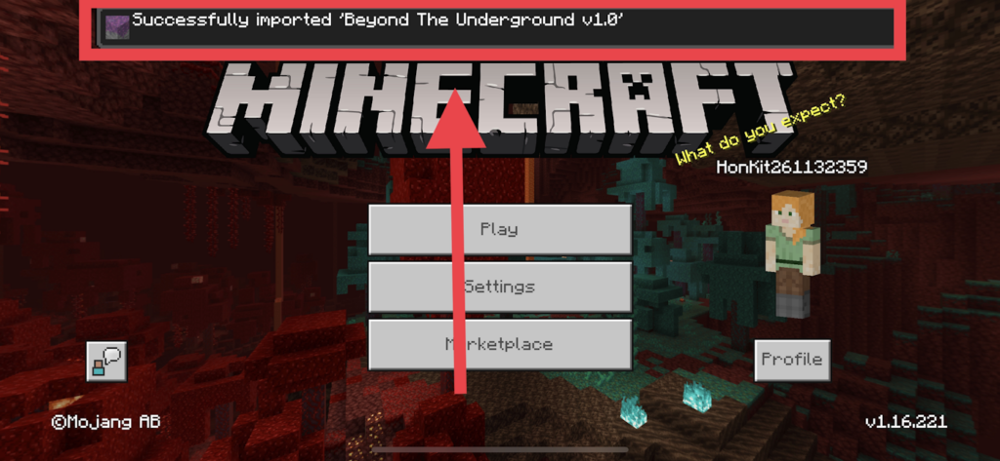

Having trouble importing .mcpack and .mcaddon files into Minecraft on iOS? Follow this tutorial!

## 1. Download the Documents by Readdle app

  
  

    
  

  
  

    You can find the app on the App Store. If you already have this app, you can skip this step.
  

## 2. Download the .mcaddon or .mcpack file.

  
  

    
  

  
  

    When the download has finished, head to the default Files app, find the file, and long press on it. Then, click on **Share**, as indicated by the red box.
  

## 3. This pop-up should appear.

  
  

    
  

  
  

    Click on **Copy to Documents**.
  

## 4. The Documents by Readdle app should launch.

  
  

    
  

  
  

    This screen should appear. Click on **Open in another app**.
  

## 5. This popup should appear.

  
  

    
  

  
  

    Select Minecraft or Minecraft Preview, based on the version of Minecraft you want the add-on imported to.
  

## 6. Done!

  
  

    
  

  
  

    The add-on should now be imported into Minecraft!
  

