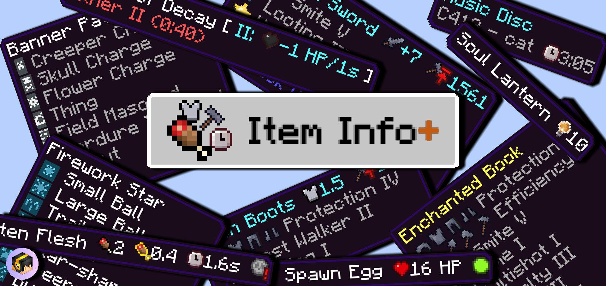

A must-have quality of life pack! Show stats on item names using simple and colorful icons. See a mob's HP, mob hostility, banner, firework, enchantment icons, foods' hunger & saturation points, armor points, potion stats, and more.

Requires Minecraft Bedrock 1.19.0 or later. [Download now!](https://www.curseforge.com/minecraft-bedrock/texture-packs/hunger-points-on-food-names)

# 4 different subpacks are available!

Go into Global Resources, activate the pack, and click on the cog next to the Deactivate button.

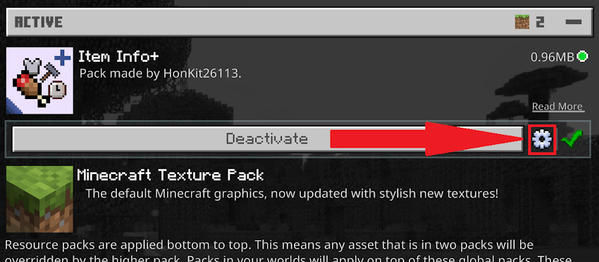

Then, simply choose what information you want to see on item names. You must **restart Minecraft** for the changes to take effect.

    <b>Click to show image</b>

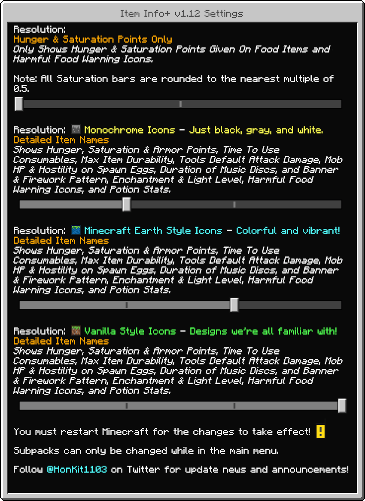

## Mode 1: Hunger & Saturation Points Only
Only the following will be shown in item names:

- the **amount of hunger points & saturation** given after being consumed

- a **warning icon** if the food is harmful

In this mode, all saturation bars are **rounded off to 1 or 0.5** due to technical and design reasons.

    <b>Click to show more</b>

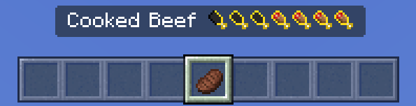

 Cooked Beef: gives 8 Hunger Points (4 Hunger Bars) & 12.8 Saturation Points (6.4 Saturation Bars, rounded to 6.5 bars)

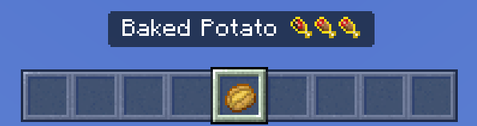

Baked Potato: gives 5 Hunger Points (2.5 Hunger Bars) & 6 Saturation Points (3 Saturation Bars)

**Please note:** Some foods give extremely low amounts of saturation and will be rounded to 0 bars.

Don't know how the saturation system works? The Minecraft Wiki has got you covered: [https://minecraft.wiki/Hunger#Mechanics](https://mcpedl.com/leaving/?url=https://minecraft.fandom.com/wiki/Hunger#Mechanics)

## Mode 2: Detailed Item Names

The following will be shown in item names & descriptions:

- Hunger, Saturation & Armor Points

- Time To Use Consumables & Warning Icons for Harmful Foods

- Max Item Durability

- Tools' Default Attack Damage

- Mob HP & Hostility on Spawn Eggs

- Duration of Music Discs

- Banner Pattern & Firework Pattern Icons

- Enchantment & Light Level Icons

- Potion & Tipped Arrow Stats

    <b>Click to show more</b>

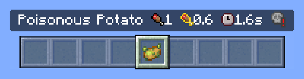

Poisonous Potato: fills 1 Hunger Bar, fills 0.6 Saturation Bars, takes 1.6 seconds to eat, and gives you harmful effects

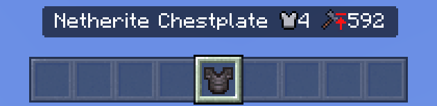

Netherite Chestplate: gives 4 Armor Points. It has a maximum of 592 durability.

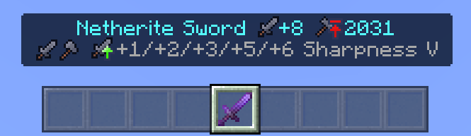

The Netherite Sword does +8 attack damage when unenchanted, and has a maximum of 2031 durability. Sharpness I - V gives 1, 2, 3, 5, and 6 additional attack damage respectively.

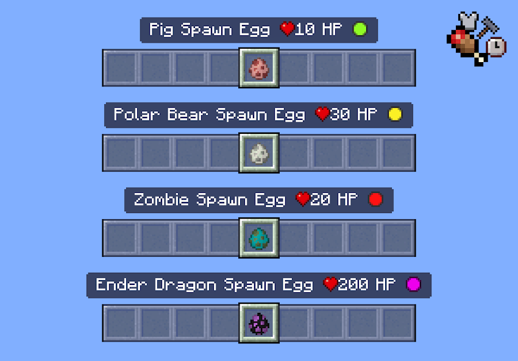

Spawn Eggs show the mob's HP and hostility. 

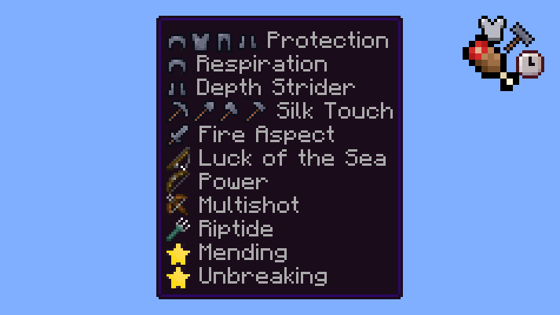

All Enchantments now have icons showing you what tool they can be applied to.

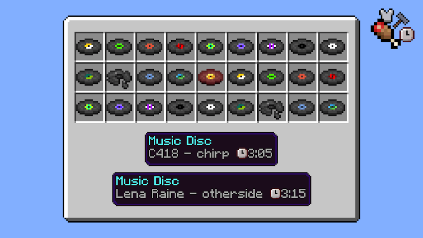

All Music Discs now show the duration of respective songs.

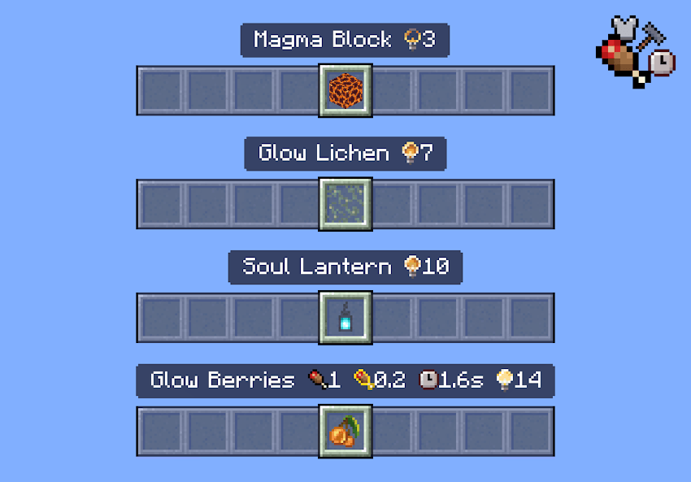

All Blocks & Items that emit light now have icons showing you their light level emission.

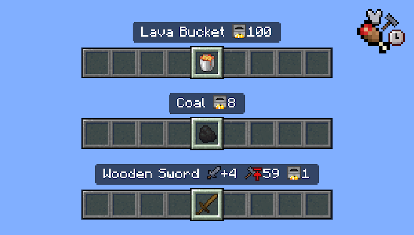

Items that can be used as furnace fuel now show the amount of items that can be smelted.

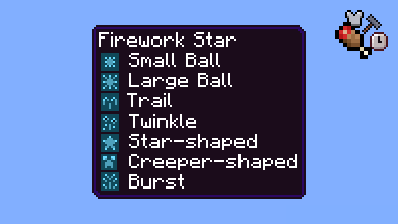

Firework Rockets & Firework Stars now have icons next to their pattern names.

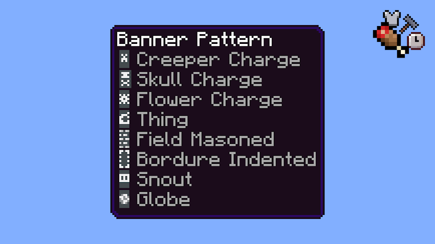

All Banner Patterns now have an icon next to their name.

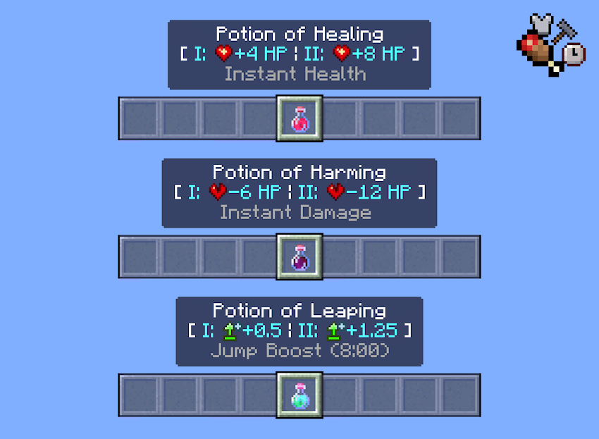

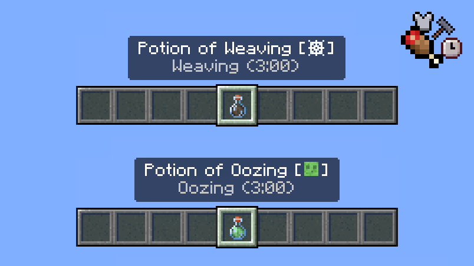

Potions & Tipped Arrows now have stats displayed next to their names! 

**Please note:** Some potions do not have any stats displayed as their effects are self-explanatory.

## Mode 2 with Minecraft Earth Style Icons

If vanilla style icons are too boring for you, you might like these icons! These icons are all in the style of Minecraft Earth. Some icons are replicated from Minecraft Earth itself!

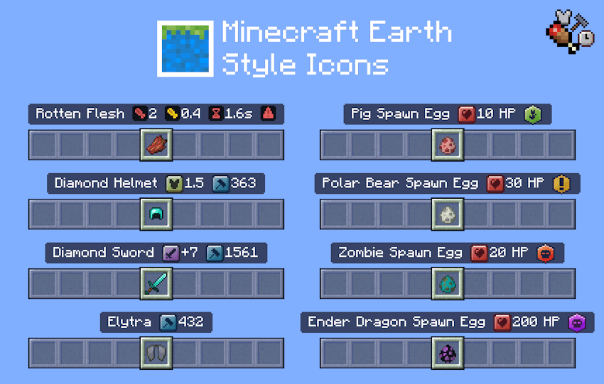

**Please note:** This icon style is only available for **Mode 2: Detailed Item Names**.

## Mode 2 with Monochrome Icons

Prefer a simpler, cleaner look? **These Monochrome Icons are only in black, gray, and white**.

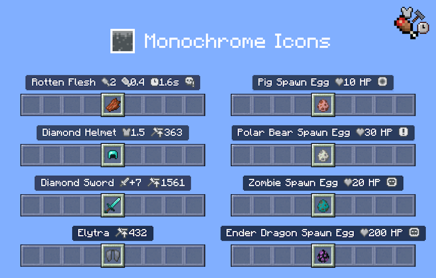

**Please note:** This icon style is only available for **Mode 2: Detailed Item Names**.

# Additional Features

There is now a new section in How to Play! This section includes an explanation of all the icons and the changelog of the latest update, so you can check without having to revisit this site every time.

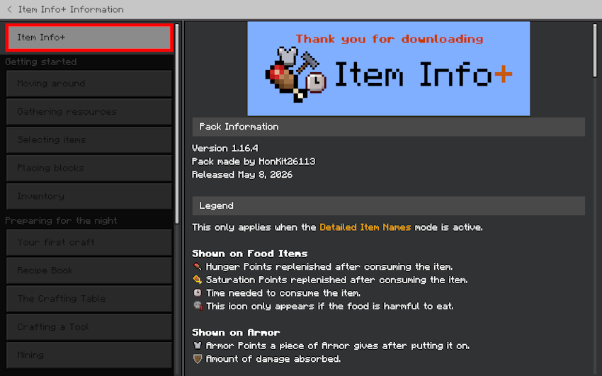

You can access this section in game easily by going to the Pause screen.

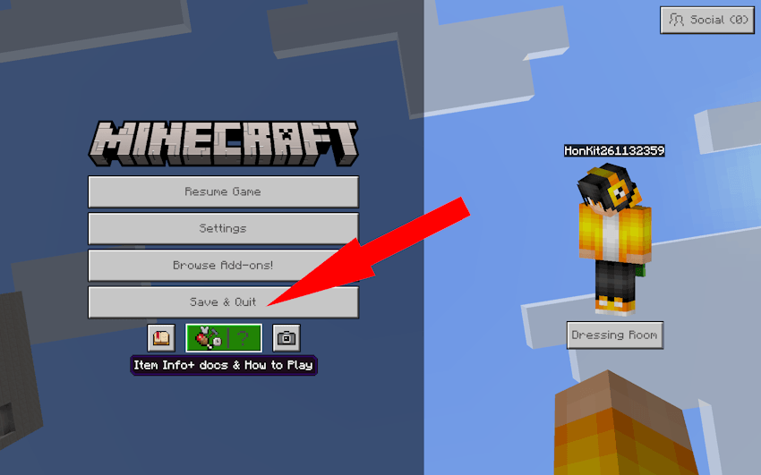

# DLCs

There is currently 1 DLC available. This is an additional pack that works together with Item Info+ to further enhance your gameplay experience.

[Download the DLC now!](../redstone-info-plus)

- **Redstone Info+**: A quality of life pack that makes it easier to build with redstone! Not only are there new textures, but icons have also been added to items to display more information.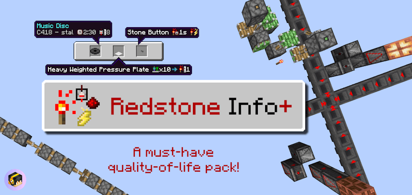

# Add-on Compatibility

- This pack supports the [Beyond The Underground add-on](../beyond-the-underground). Place the resource packs in the following order for the packs to work correctly. Even if you have already enabled the pack in Global Resources, you still need to activate it again per world.

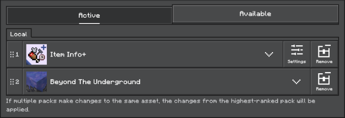

Beyond The Underground is an add-on that adds many new cave types for you to explore! Download the pack today!

# Terms of Use

### **You are allowed to:**

- Edit the pack for **personal use**.

- Use the pack in your **private modpack** that you aren’t releasing publicly. You **cannot** use the pack in a public modpack.

- **Make videos & media content** with the pack.

### **You are NOT allowed to:**

- Distribute the pack using a new download link. Always share the link to to this page.

- Monetize the pack download. Doing so will result in a copyright takedown.

# Changelog

 <b>Click here to show changelog</b>

Version 1.16.4  
Released May 8, 2026

**New Additions and Changes:**

- Chaos Cubed Support:
    - Added HP and hostility icons for the Sulfur Cube spawn egg.

- Other Changes:
    - Moved the Item Info+ settings page to the How To Play screen. The new Ore UI settings page cannot be modified by resource packs.
    - Updated the How to Play icon in the Pause screen to also include the Item Info+ logo.