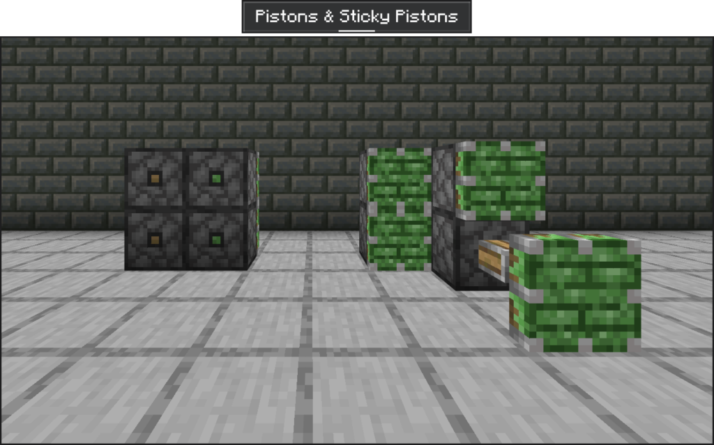
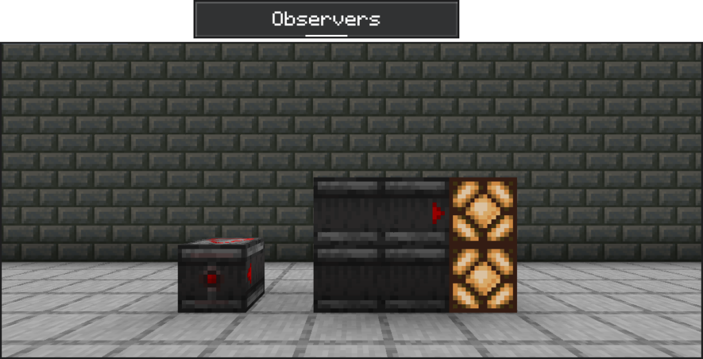
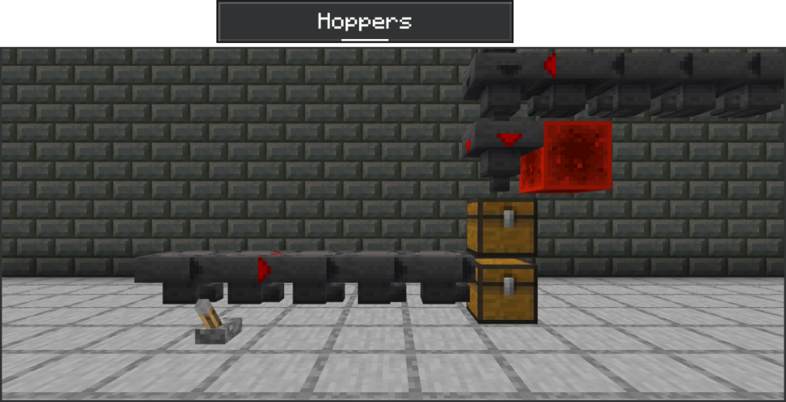
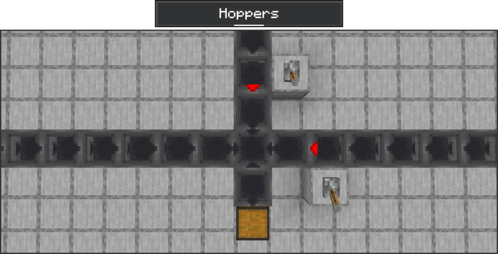
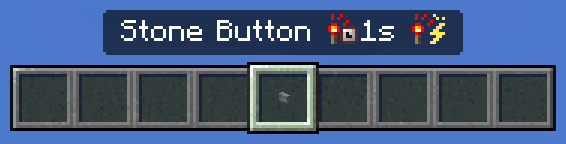
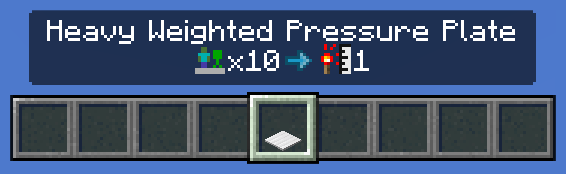
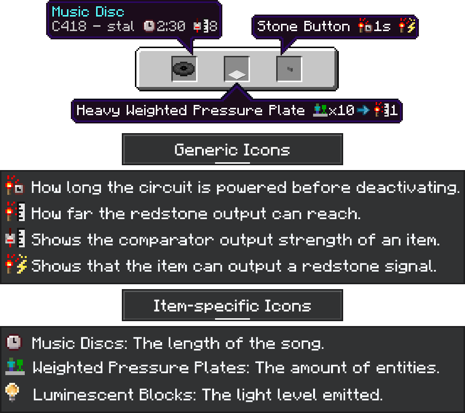
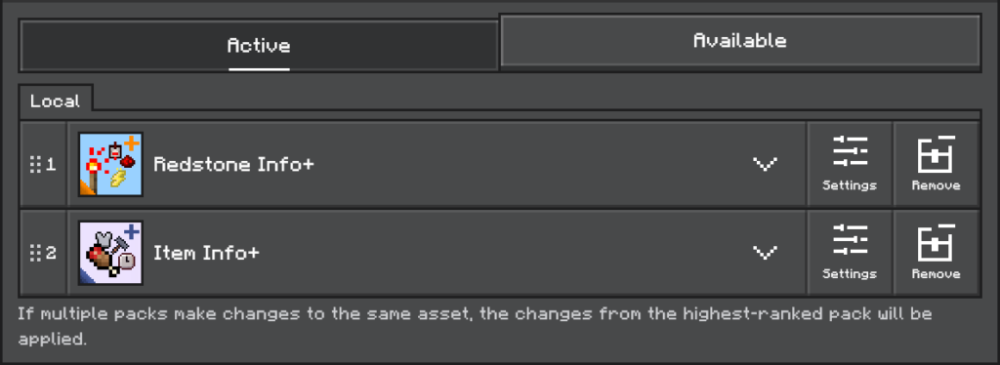

A quality of life pack that makes it easier to build with redstone! This pack not only adds new textures, but also new icons to item names to display more information.

Requires Minecraft Bedrock 1.18.0 or later. [Download Now!](https://honkit26113.com/wp-content/uploads/2025/03/Redstone-Info-v1.0.mcpack)

# Block Texture Changes

The textures of some blocks have been changed to make for a better gameplay experience.

The back texture has been updated to differentiate normal pistons from sticky pistons. Sticky pistons are now stickier with slime dripping off the side.

When observers output a redstone signal, the sides, top and bottom will also blink.

The side textures of Hoppers now show their direction and whether the block is powered by redstone, preventing items from passing through.

The top texture of Hoppers has also been changed.

# Icons on Item Names

Icons are displayed on the item names of some redstone components to display more information about them.

Stone Buttons remain active for 1 second after being pressed, and they can output a redstone signal.

The output strength of Heavy Weighted Pressure Plates increases by 1 for every 10 entities that stand on them.

Here are other icons that will be displayed. This information can be found in-game in a special Redstone Info+ panel in the settings!

# Add-on Compatibility

This pack is compatible with the [Item Info+ resource pack](../item-info-plus), another quality-of-life pack that adds information on item names! Arrange the packs in the following order to achieve the best effect.

# Terms of Use

### **You are allowed to:**

- Edit the pack for **personal use**.

- Use the pack in your **private modpack** that you aren’t releasing publicly. You **cannot** use the pack in a public modpack.

- **Make videos & media content** with the pack.

### **You are NOT allowed to:**

- Distribute the pack using a new download link. Always share the link to to this page.

- Monetize the pack download. Doing so will result in a copyright takedown.

**Please Note**: This pack only supports English (US) currently. Version support for all other languages will be added in a future update.
